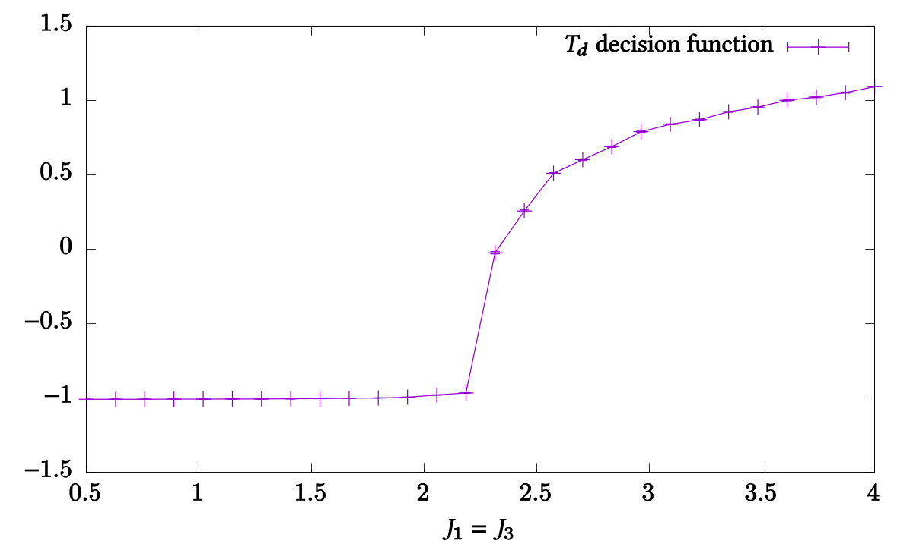
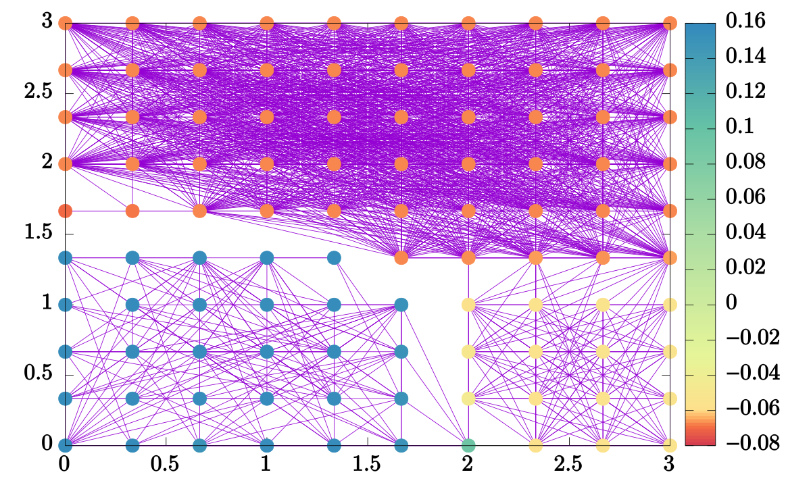
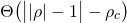
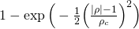
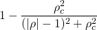

Probing hidden spin order with interpretable machine learning
=============================================================

These are the source codes accompanying the papers:
* Jonas Greitemann, Ke Liu, and Lode Pollet: _Probing hidden spin order with
  interpretable machine learning_, [**Phys. Rev. B 99, 060404(R) (2019)**][9],
  open access via [arXiv:1804.08557][1];
* Ke Liu, Jonas Greitemann, and Lode Pollet: _Learning multiple order parameters
  with interpretable machines_, [**Phys. Rev. B 99, 104410 (2019)**][11], open
  access via [arXiv:1810.05538][10];
* Jonas Greitemann, Ke Liu, Ludovic D.C. Jaubert, Han Yan, Nic Shannon, and Lode
  Pollet: _Identification of emergent constraints and hidden order in frustrated
  magnets using tensorial kernel methods of machine learning_, [**Phys. Rev. B
  100, 174408 (2019)**][18], open access via [arXiv:1907.12322][16].

They aim to provide a reusable framework that may be used to apply the TK-SVM
method to third-party Monte Carlo simulations written using ALPSCore ([→ Project
structure](#project-structure)). The [gauge theory code](./gauge) used for the
first two papers is included as part of this repository. The simulation of the
XXZ pyrochlore model for the third paper is not openly available, yet the
present version of the framework contains many of the supporting features. While
this version is still capable of producing the results presented in the first
two papers, you may want to check out the versions of the code that were
originally published along with the first two papers. The relevant commits are
tagged `PRB-99-060404(R)` and `PRB-99-104410`, respectively, _i.e._ run

```bash
$ git checkout PRB-99-060404(R)
$ git checkout PRB-99-104410
```

Additionally [J. Greitemann's PhD thesis][17] includes results for the
simulation of the Kagome antiferromagnet which may also be reproduced using the
present version of the code.

Contents
--------

* [Dependencies](#dependencies)
* [Project structure](#project-structure)
* [Building and installation](#building-and-installation)
  - [Building and installing ALPSCore](#building-and-installing-alpscore)
  - [Building client codes](#building-client-codes)
    - [Build configuration](#build-configuration)
* [Basic usage](#basic-usage)
  - [Parameter files](#parameter-files)
  - [Sampling: collecting Monte Carlo snapshots from across the parameter space](#sampling-collecting-monte-carlo-snapshots-from-across-the-parameter-space)
  - [Learning: SVM optimization](#learning-svm-optimization)
  - [Testing: measuring decision function and observables](#testing-measuring-decision-function-and-observables)
  - [Extracting the coefficient matrix](#extracting-the-coefficient-matrix)
  - [Spectral graph partitioning analysis](#spectral-graph-partitioning-analysis)
* [Runtime parameters](#runtime-parameters)
  - [Simulation runtime](#simulation-runtime)
  - [Phase diagram point specification](#phase-diagram-point-specification)
  - [Sweep through the phase diagram](#sweep-through-the-phase-diagram)
  - [Classifiers](#classifiers)
  - [SVM optimization (learning)](#svm-optimization-learning)
  - [Testing stage](#testing-stage)
* [Client code API](#client-code-api)
  - [`phase_point` specification](#phase_point-specification)
  - [Parallel tempering](#parallel-tempering)
* [License](#license)

A [Changelog](CHANGELOG.md) is provided separately.

Dependencies
------------

These codes are based on the [ALPSCore][2] library. Refer to [their website][3]
for installation instructions. ALPSCore requires the Boost and HDF5 libraries.

Further, we require a C++ compiler (tested with GCC 9 and Clang 8) with
C++14 support. For the solution of the SVM optimization problem, we rely on the
[libsvm][4] library which is included as part of our self-developed [C++ wrapper
library][5] which is kept _in-tree_ as a git submodule. [Argh!][12] is used for
parsing command line options. [Eigen 3][8] is used for linear algebra.
As of version 3.0, MPI is used for parallelization. A thread-safe MPI
implementation is hence required (`MPI_THREAD_MULTIPLE` build option enabled;
tested with Open MPI 4.0 and MPICH 3.3).

Project structure
-----------------

This repository contains three client codes which are for the most part regular
Monte Carlo simulation codes based on the ALPSCore framework. In addition they
implement the relevant [API functions](#client-code-api) required by the TK-SVM
framework.

The client codes are kept in their eponymous subdirectories:
* [`ising`](./ising): This is a copy of the ALPSCore demo code for the 2D Ising
  model. It may be used to reproduce the results presented in
  [**P. Ponte and R.G. Melko, Phys. Rev. B 96, 205146 (2017)**][13].
* [`gauge`](./gauge): Lattice gauge model proposed in [**K. Liu, J. Nissinen,
  R.-J. Slager, K. Wu, and J. Zaanen, PRX 6, 041025 (2016)**][14] which lets us
  realize arbitrary orientational orders and was used to produce the results in
  our first two papers.
* [`frustmag`](./frustmag): A generic code for classical Monte Carlo
  simulations of models of frustrated magnets. Several lattice geometries are
  available to choose from, additional interactions may be included with
  relative ease. Supports several update schemes, including parallel tempering.
  This implementation was used to generate data for the study of the Kagome
  antiferromagnet in Ch. 9 of [J. Greitemann's PhD thesis][17].

Additional information on the runtime parameters pertaining to these client
codes are documented in the README files accompanying these respective
subdirectories.

This project is designed as a generic framework that works with existing Monte
Carlo codes with minimal adaptation. Any code outside the client-code
directories is designed to be agnostic with respect to the client codes. For
each of the client codes, several executables are generated, replacing the
`main` function of a typical ALPSCore simulation and ending in the following
suffixes:
* [`*-sample`][19]: Run the Monte Carlo simulations at different points in the
  phase diagram, occasionally sampling the spin configuration and optionally
  applying the monomial mapping. The point in phase diagram space is recorded
  along with the raw (in `LAZY` mode) or mapped (in `EAGER` mode) configuration.
  The resulting optimization problem is saved in a checkpoint file ending in
  `*.clone.h5`.
* [`*-learn`][20]: Read one or more checkpoint files (`*.clone.h5`), label the
  samples according to the chosen [→ Classifier](#classifiers), and perform the
  SVM optimization. The resultant SVM model is saved to disk in a file ending in
  `*.out.h5`.
* [`*-test`][21]: Run the Monte Carlo simulation along a set of parameter points
  in the phase diagram. If launched from an `*.out.h5` file, the SVM model is
  evaluated and the decision function and its variance are measured as
  observables. Additionally, any other predefined reference observables are
  measured. If launched from an `*.ini` file instead, only the latter
  observables are measured.
* [`*-coeffs`][22]: Extract the coefficient matrix from the SVM model to infer
  the analytical order parameter.
* [`*-segregate-phases`][23]: Carry out the graph analysis to find the phase
  diagram without prior knowledge of the correct phase classification.


Building and installation
-------------------------

### Building and installing ALPSCore

Detailed instructions on [how to build ALPSCore][7] can be fournd in the
project's wiki. The procedure revolves around the following:

```bash
$ cd alpscore
$ mkdir build.tmp && cd build.tmp
$ cmake ..
$ make -jN
$ make test
$ make install
```

Replace `N` with the number of threads you want to use to build, e.g. `-j8`.
You may want to specify additional flags to `cmake`:

  * `-DCMAKE_INSTALL_PREFIX=$HOME/.local`, or another custom install location.
    This is required if you don't have permission to write to the default
    install prefix path (`/usr/local`). Mind that ALPSCore installs a CMake
    script that has to be picked up by CMake when building our codes. Thus, any
    non-standard install location needs to be matched by a
    `-DCMAKE_PREFIX_PATH=<...>` flag when configuring the client codes.
  * If a local version of boost has been installed, you may need topoint CMake
    to it by specifying `-DBOOST_ROOT=/path/to/boost/install`. Otherwise your
    local version may not be found, or be shadowed by an incompatible version.

### Building client codes

The TK-SVM framework does not follow a traditional build model, in that it does
_not_ provide a library for the client codes to link against. This is rooted in
the fact that it provides `main` functions for the five executables mentioned in
the foregoing section. Instead, the root-level
[`CMakeLists.txt`](./CMakeLists.txt) exposes the relevant source files as CMake
variables `${TKSVM_SAMPLE_SRC}` (and analogous for the other executables), the
libraries as `${TKSVM_LIBRARIES}` and the include directories as
`${TKSVM_INCLUDE_DIRS}`.
These may then be used from the `CMakeLists.txt` file of each of the client
codes. It must also add the compile definitions exposed in
`${TKSVM_DEFINITIONS}` and additionally define a variable `TKSVM_SIMINCL`
holding the name of the header of the main ALPSCore simulation class which
should define a type (alias) `sim_base` to that class.

Refer to the build file of one of the client codes (_e.g._
[`gauge/CMakeLists.txt`](./gauge/CMakeLists.txt)) for an example. Third-party
client codes may rather keep this repository as a submodule in their own tree,
in which case the line

    add_subdirectory(.. tksvm)

simply becomes

    add_subdirectory(svm-order-params)

Refer to the READMEs of the client codes for build instructions on them
specifically, e.g. [Building the `gauge` client
code](./gauge#building-and-installation).


#### Build configuration

Most of the behavior of the programs can be controlled through runtime
parameters. However, some options have to be selected at compile time via the
CMake variables listed below. To customize a variable, pass the appropriate flag
on to CMake, _e.g._

```bash
$ cmake -DCONFIG_MAPPING=LAZY ..
```

or use the interactive `ccmake` configurator.

| Variable name          | Possible values                                                    |
|:-----------------------|:-------------------------------------------------------------------|
| `ALPSCore_DIR`         | `nonstandard/path/to/share/ALPSCore`                               |
| `Eigen3_DIR`           | `nonstandard/path/to/share/eigen3/cmake`                           |
| `CMAKE_BUILD_TYPE`     | `Release` (_default_), `Debug`                                     |
| `CMAKE_INSTALL_PREFIX` | path to install directory (executables will be copied into `bin/`) |
| `SVM__ENABLE_TESTS`    | `OFF` (_default_), `ON`                                            |
| `CONFIG_MAPPING`       | `EAGER` (_default_), `LAZY`                                        |


Basic usage
-----------

This section demonstrates the basic usage of the framework, drawing from the
examples provided along with the `gauge` client code as an example, though the
principles hold true for all applications.

### Parameter files

Simulation parameters are stored in INI-style files.

We provide example parameter files for each client code, in their respective
`params` directories (e.g. [for the gauge code](./gauge/params)).
Each parameter file comes with a brief comment which explains its purpose and
includes the shell commands to run that particular simulation.
They also contain estimates for the run time of the individual steps.

In the following subsections, we will give a more detailed description of some
aspects of the learning, testing, and analysis stages. For a (somewhat)
comprehensive listing of supported parameters, refer to the section entitled
[→ _Runtime parameters_](#runtime-parameters).

### Sampling: collecting Monte Carlo snapshots from across the parameter space

The `*-sample` binaries run the Monte Carlo simulation at a number
of points in the phase diagram. The configurations are sampled periodically and
stored as the _optimization problem_ in a file ending in `.clone.h5`. For
example,
```bash
$ mpirun -n 4 gauge-sample Td-hyperplane.ini
```
will carry out Monte Carlo simulations of the gauge model with the tetrahedral
_T<sub>d</sub>_ symmetry group.

_Note:_ Both the `*-sample` and `*-test` programs rely on MPI for
parallelization. Replace `4` with the number of MPI processes you want to run
in parallel.

**Time limit:** If the required amount of Monte Carlo steps cannot be carried
out within [`timelimit`](#simulation-runtime) seconds, the simulation terminates
prematurely and the incomplete data are written to `Td-hyperplane.clone.h5`. One
can resume the simulation with
```bash
$ mpirun -n 4 gauge-sample Td-hyperplane.clone.h5
```

**Sweep policy:** The set of parameter points at which samples are collected is
determined by a so-called _sweep policy_. Multiple, rather flexible, options
exist which are documented and elaborated in the section entitled
[→ _Sweep through the phase diagram_](#sweep-through-the-phase-diagram).

**`EAGER` vs. `LAZY` mode**

Dependent upon the build-time option `CONFIG_MAPPING`, the `*-sample` program
may or may not already carry out the tensorial feature mapping on the data. In
`EAGER` mode, the mapping is carried out as soon as a snapshot is sampled and
only the tensorial features are stored. For large lattices and modest ranks,
this provides potentially huge savings in storage and memory. On the flipside,
the user commits themselves to a fixed choice of the tensorial kernel (TK) rank
and cluster choice.

In `LAZY` mode, the mapping to monomial features is deferred until the learning
stage and the full spin configurations are stored in the `*.clone.h5` file. This
may be desirable when the Monte Carlo simulation is particularly hard and
requires long intermediate updates to generate independent configurations. In
this scenario, large lattices and huge amounts of samples are typically
unreachable anyway, so storing the full spin configurations remains feasible.
The lazy mode then helps to avoid having to run the costly simulations
separately for each choice of the TK rank or spin cluster; rather, the
corresponding parameters can be overridden when launching the `*-learn` program.

Note that the choice of the `CONFIG_MAPPING` build option modifies the internal
representation used in the `*.clone.h5` files, so files generated using one
option are incompatible to programs built using the other.

### Learning: SVM optimization

The `*-learn` binary takes the samples stored in one or multiple `*.clone.h5`
files and performs the actual SVM optimization, saving the result in a file
ending in `*.out.h5`.

```bash
$ gauge-learn Td-hyperplane.clone.h5
```

**Labeling samples:** Within the `*.clone.h5` files, the samples are stored
along with the full point in parameter space they have been sampled at. Before
the data can be fed to the SVM, those points have to be mapped to discrete
(one-dimensional) labels. This labeling is done by a component called the
[→ classifier](#classifiers). Since many different strategies for labeling are
conceivable, corresponding to varying degrees of physical prior knowledge on the
system or knowledge gained through previous analyses, the _classifier policy_
can be selected and configured from a range of options at runtime. For example,
the parameter file
[`gauge/params/Td-hyperplane.ini`](gauge/params/Td-hyperplane.ini) uses the
`hyperplane` classifier, mapping the phase diagram points to a binary label,
indicating if samples are from the ordered or disordered phase, respectively.
For options on the choice and configuration of the different classifiers, refer
to the [dedicated section](#classifiers).

**Multiclassification:** In contrast, when using the _D<sub>2h</sub>_ symmetry
group,
```bash
$ mpirun -n 4 gauge-sample D2h-phase-diagram.ini
$ gauge-learn D2h-phase-diagram.clone.h5
```
the phase diagram features three phases called _O(3)_ (isotropic),
_D<sub>∞h</sub>_ (uniaxial), and _D<sub>2h</sub>_ (biaxial). The parameter file
[`gauge/params/D2h-phase-diagram.ini`](gauge/params/D2h-phase-diagram.ini) is
intended to be used with the `phase_diagram` classifier which maps the
_(J<sub>1</sub>, J<sub>3</sub>)_ points to three labels, `O(3)`, `Dinfh`, and
`D2h`, according to the known phase diagram. The SVM will then solve three
classification problems, yielding one decision function to distinguish between
each pair of the labels. Given that the labels indeed correspond to the physical
phases and the rank is chosen appropriately (as is the case for the
_D<sub>2h</sub>_ example), these three decision functions can be related to the
order parameter(s).

Note that the same samples can also be used with a different classifier by
overriding the `classifier.policy` parameter. For example, when selecting the
`fixed_from_sweep` classifier, the samples will be labeled according to the grid
points in phase diagram space from which they have been sampled:

```bash
$ gauge-learn D2h-phase-diagram.clone.h5 \
    --nu=0.1                             \
    --classifier.policy=fixed_from_sweep \
    --outputfile=D2h-grid.out.h5
```

The phase diagram has previously been sampled on a 10 x 10 grid, hence, the
samples are now assigned 100 distinct labels, resulting in 100 * 99 / 2 = 4950
decision functions. The result is written to the alternative location
`D2h-grid.out.h5` to avoid overwriting the previous result. It is obviously not
feasible to interpret each of the decision functions individually, but we can
use their bias parameters for the
[→ _graph analysis_](#spectral-graph-partitioning-analysis). To that end, a
moderate regularization level is appropriate; hence _ν_ = 0.1 is chosen.

**Merging additional clones:** One may also perform the SVM optimization on a
collection of samples drawn from a variety of different runs of the `*-sample`
program with different, potentially overlapping sweeps through the parameter
space. This is possible; one can provide additional `*.clone.h5` files in a
colon-separated string to the `merge` parameter:

```bash
$ gauge-learn first.clone.h5 --merge=second.clone.h5:third.clone.h5
```

Note that `first.clone.h5` is special in that its parameters are used
subsequently, specifically they determine the selected classifier used to label
_all_ samples, including those contributed by `second.clone.h5` and
`third.clone.h5`.

**Command line options**

| Long flag                    | Short | Description                                                                                                         |
|:-----------------------------|:-----:|:--------------------------------------------------------------------------------------------------------------------|
| `--help`                     | `-h`  | Display ALPSCore help message (lists parameters)                                                                    |
| `--merge=<clone-list>`       |       | Specify a colon-separated list of additional `*.clone.h5` files whose samples should be included in the analysis    |
| `--infinite-temperature`     | `-i`  | Include `sweep.samples` fictitious samples as obtained from `Simulation::random_configuration()` as a control group |
| `--statistics-only`          |       | Collect all samples, label them by the classifer and print their statistics, but forego the actual SVM optimization |

Note that additionally [runtime parameters](#runtime-parameters) may also be
overridden using command line arguments.

### Testing: measuring decision function and observables

```bash
$ mpirun -n 4 gauge-test Td-hyperplane.out.h5
```

will read the SVM model that was previously learned and measure its decision
function as an observable in independent Monte Carlo simulations. Additionally,
any observables that are ordinarily measured in the simulation's `measure()`
function will be measured as well. It is also possible to invoke the `*-test`
program on an `*.ini` file, _e.g._
```bash
$ mpirun -n 4 gauge-test Td-hyperplane.ini
```
which will measure _only_ those ordinary observables and not attempt to evaluate
any SVM model. This may be useful then debugging the simulation itself.

The set of parameter points at which measurements are to be taken is again
specified by a _sweep policy_ in much the same way this is done for the
`*-sample` program. Refer to the detailed explanation of the [testing stage
parameters](#testing-stage) below. The example
[`Td-hyperplane.ini`](gauge/params/Td-hyperplane.ini) sweeps a number of points
on a line segment between two end points in the parameter space.

**Output format:** The results are summarized in a text file
`Td-hyperplane.test.txt` and full observables are stored in
`Td-hyperplane.test.h5`. The `*.test.txt` is self-documenting (generating
comments indicating the column layout at the beginning of the file) and suitable
for plotting using `gnuplot`. A plot of the decision function can be created
using:

    gnuplot> plot 'Td.test.txt' using 2:5:6 with yerrorlines



**Variances:** For any observable `Obs` that is measured by the simulation's
`measure()` function and for which there exists another observable named
`Obs^2`, the `*.test.txt` will additionally contain columns giving the variance
of `Obs`, as calculated using the formula `<Obs^2> - <Obs>^2`, including an
error estimate on that variance, as obtained from jackknife resampling. This
extends to the SVM decision function(s) whose squares are also always measured.
The physical utility of the variables of decision functions, particularly some
analogies to generalized susceptibilities, are discussed in
[arXiv:1907.12322][16].

_Note:_ Variances are also calculated for observables of higher powers or
absolute values, _e.g._ when measuring all of `Obs`, `|Obs|`, `Obs^2`, `Obs^4`,
and `Obs^8`, the variances of `Obs`, `|Obs|`, `Obs^2`, and `Obs^4` are all
calculated.

**Command line options**

| Long flag                    | Short | Description                                                       |
|:-----------------------------|:-----:|:------------------------------------------------------------------|
| `--help`                     | `-h`  | Display ALPSCore help message (lists parameters)                  |
| `--rescale`                  | `-r`  | Shift decision functions by the bias and rescale to unit interval |

Note that additionally [runtime parameters](#runtime-parameters) may also be
overridden using command line arguments.

### Extracting the coefficient matrix

```bash
$ gauge-coeffs Td-hyperplane.out.h5 -u
```

reads the SVM model and contracts over the support vectors to extract the
coefficient matrix, block structure, and performs miscellaneous analyses and
processing steps, such as fitting and removing self-contractions or comparing to
the exact result.

The three panels in [Fig. 2 of arXiV:1804.08557][1] can be reproduced by the
following invocations:
```bash
$ gauge-coeffs Td-hyperplane.out.h5 -u
$ gauge-coeffs Td-hyperplane.out.h5 -u --block=[lmn:lmn]
$ gauge-coeffs Td-hyperplane.out.h5 -u --block=[lmn:lmn] --remove-self-contractions
```

These options are detailed below.

**Index arrangement**

* `-u | --unsymmetrize`: coefficients involving redundant monomial
  (_cf._ [Supplementary Materials][1]) are reconstructed, _i.e._ the coefficient
  value of the corresponding non-redundant coefficient is copied.
* `-r | --raw`: the indicies are *not* rearranged. By default, the indices are
  reshuffled in the form _(α<sub>1</sub>, ..., α<sub>n</sub>, a<sub>1</sub>,
  ..., a<sub>n</sub>)_ and lexicographically ordered such that the color-block
  structure becomes apparent. Specifying this flag disables this, and indices
  are arranged as _(α<sub>1</sub>, a<sub>1</sub>, ..., α<sub>n</sub>,
  a<sub>n</sub>)_.

**Extracting individual blocks**

The program has two major modes: extraction of the full coefficient matrix and
*single-block mode* where a single block is targeted and extracted exclusively.
This is done by specifying the command line parameter `--block=<block-spec>`
where `<block-spec>` identifies a block by its color indices. _E.g._ in the case
of the tetrahedral (rank-3) order, the non-trival block can be found by
specifying `--block=[lmn:lmn]`.

**Contraction analysis**

* `-c | --contraction-weights`: for each block (or only the single block),
  perform a least-squares fit of contraction "masks" to obtain the coefficients
  with which each contraction contributes and output those.
* `-s | --remove-self-contractions`: perform the same analysis as above, but
  consequently isolate the contributions due to self-contractions and subtract
  them from the full coefficient matrix.

Note that "blocks" refers to the representation where indices have been
reshuffled. When the full coefficient matrix is extracted, the contraction
analysis (`-c`, `-s`) operates on the symmetrized representation where redundant
element have not been reinstated and "blocks" are actually non-local. In
single-block mode however, this would not work because the equivalents of
redundant elements are actually part of different blocks. Thus, in single-block
mode, the contraction-analysis is performed on the "unsymmetrized" (redundant)
representation. Consequently, the contraction coefficients will be different
from those obtained for the same block in full-matrix mode, as now equivalent
contractions will contribute evenly, as opposed to only those contractions that
are compatible with the symmetrization.

**Multiclassification**

When analyzing the result of a multiclassification problem (see the
_D<sub>2h</sub>_ example above), the analysis is performed for each decision
function separately. Because of the quadratic growth of the number of decision
functions, this can get messy for big multiclassification problems. Instead, one
can list the decision functions and their biases without extracting the
coefficient matrices using:

```bash
$ gauge-coeffs D2h-hyperplane.out.h5 --list
0:   O(3) -- Dinfh     rho = -1.0052
1:   O(3) -- D2h       rho = -1.00266
2:   Dinfh -- D2h      rho = -0.659734
```

In this lists, the decision functions are given a running number. This number
can be used to select a single decision function and extract only its
coefficient matrix. For example, to limit the analysis to the _O(3) /
D<sub>2h</sub>_ transition:

```bash
$ gauge-coeffs D2h-hyperplane.out.h5 -u --transition=1
```

**Command line options**

| Long flag                    | Short | Description                                                                                                                                                                   |
|:-----------------------------|:-----:|:------------------------------------------------------------------------------------------------------------------------------------------------------------------------------|
| `--help`                     | `-h`  | Display ALPSCore help message (lists parameters)                                                                                                                              |
| `--verbose`                  | `-v`  | Print information on currently running step                                                                                                                                   |
| `--list`                     | `-l`  | List the transitions between labels and their bias value, but do not write any files                                                                                          |
| `--transition=<num>`         | `-t`  | Rather than extracting coefficients for all transitions in a multiclassification setting, only consider the transition numbered `<num>` (as listed using the `--list` option) |
| `--unsymmetrize`             | `-u`  | Assign the extracted coefficient to _all_ equivalent monomials, rather than only to a single representative                                                                   |
| `--raw`                      | `-r`  | Indicies are *not* rearranged; redundant monomials are not included in the output pattern                                                                                     |
| `--blocks-only`              | `-b`  | Skip output of the full coefficient matrix and only output block structure; unavailable (and pointless) in single-block mode.                                                 |
| `--block=<block-spec>`       |       | Only output the coefficient matrix block identified by `<block-spec>`                                                                                                         |
| `--contraction-weights`      | `-c`  | For each block (or only the single block), perform a least-squares fit of contraction "masks" to obtain the contributions of each contraction and output those.               |
| `--remove-self-contractions` | `-s`  | Perform the same analysis as above, but consequently isolate the contributions due to self-contractions and subtract them from the full coefficient matrix.                   |
| `--exact`                    | `-e`  | Calculate and output the exact result (as specified by `--result`) for the coefficient matrix (if available)                                                                  |
| `--diff`                     | `-d`  | Output the deviation from the exact result (as specified by `--result`) for the coefficient matrix and print total relative deviation _δ_                                     |
| `--result=<name>`            |       | The name of the exact result to look up; hardcoded values: `Cinfv`, `Dinfh`, `D2h`; required when using `--exact` or `--diff`                                                 |

Short flags may be combined into one multi-flag, as is customary for
POSIX-compatible programs.

### Spectral graph partitioning analysis

The `*-segregate-phases` program is intended to be used in conjunction with
massive multiclassification programs (such as the previously constructed file
`D2h-grid.out.h5`) to infer the topology of the phase diagram based on the bias
criterion.

The rationale is, that if the bias of a decision function between two points is
far from one (the ideal value expected for a physical transitions), those two
points are either in the same phase, or the phase transition could not be
captured at the rank considered. We then go ahead and construct an undirected
simple graph by adding an edge connecting those two points (vertices). On the
other hand, if the bias is "close" to one, we assume there is a phase transition
taking place between the points and we don't put an edge. The threshold value
_ρ<sub>c</sub>_ can be tuned to control the inclusivity of the criterion: an
edge is included in the graph if the deviation of corresponding unoriented bias
_|ρ|_ from unity exceeds _ρ<sub>c</sub>_: _||ρ| - 1| > ρ<sub>c</sub>_.

The resulting graph can be subjected to a spectral partitioning analysis. To
that end, the eigendecomposition of the [Laplacian][15] of the graph is
calculated. The degeneracy of the lowest eigenvalue (zero) indicates the number
of connected components within the graph. We recommend to choose _ρ<sub>c</sub>_
such that the graph consists of a single connected component, _i.e._ a slightly
larger value of _ρ<sub>c</sub>_ would lead to a degeneracy of eigenvalue zero.
For the above example of the _D<sub>2h</sub>_ symmetry, this sweet spot happens
to be achieved at around _ρ<sub>c</sub>=0.9_, but your mileage may vary:

```bash
$ gauge-segregate-phases D2h-grid.out.h5 --rhoc=1.0
Degeneracy of smallest eval: 2
$ gauge-segregate-phases D2h-grid.out.h5 --rhoc=0.9
Degeneracy of smallest eval: 1
```

Then, the second largest eigenvalue is the so-called _algebraic connectivity_
and its corresponding eigenvector, the _Fiedler vector_ can be used to infer the
phase diagram: if the graph features regions which are strongly intraconnected,
but weakly interconnected, the algebraic connectivity will be small and the
entries of the Fiedler vector will cluster such that the entries corresponding
to intraconnected regions will have a similar value.

Thus, the Fiedler vector can be visualized and will be reminiscient of the phase
diagram. To that end, the `*-segregate-phases` program outputs two files,
`edges.txt` and `phases.txt`. The former lists pairs of points corresponding to
the edges of the graph, the latter gives _all_ the eigenvectors of the Laplacian
matrix such that the second dataset (index 1) is the Fiedler vector. Using
gnuplot, we can see that we achieve a decent approximation of the
_D<sub>2h</sub>_ phase diagram:

    gnuplot> plot 'edges.txt' using 2:1 with lines, \
                  'phases.txt' index 1 using 2:1:3 with points pt 7 lc palette



**Weighted graphs**

Rather than making a binary decision on whether or not to include an edge into
the graph, one can in some situations obtain better results by constructing a
weighted graph whose edges have weights which are calculated from their biases
by means of a weighting function _w(ρ)_. Three options are provided which may be
selected using the `--weight` flag:

| `<weight-func-name>` | Equation _w(ρ)_                                          | Default value of _ρ<sub>c</sub>_                             |
|:---------------------|:--------------------------------------------------------:|:-------------------------------------------------------------|
| `box` (_default_)    |                |                              1                               |
| `gaussian`           |      | _standard deviation of the distribution of ρ values_         |
| `lorentzian`         |  | _half interquartile spacing of the distribution of ρ values_ |

In each of these, the parameter _ρ<sub>c</sub>_ constitutes a characteristic
scale. The default `box` option corresponds to the strategy using unweighted
graphs outlined above.

**Masks**

In phase diagrams where multiple different transitions occur at different ranks,
it may be desirable to exclude a region of the parameter space which has been
identified to exhibit order at a certain rank from the subsequent analysis of
the remaining parameter space at higher ranks. An example of this can be found
in the easy-plane antiferromagnetic (AF) phase in the pyrochlore XXZ model
studied in [arXiv:1907.12322][16]. To this end, the `*-segregate-phases` program
allows for the creation and application of "masks". Sticking with the example of
the AF phase, one first performs a graph analysis of the whole parameter space
at rank 1. The resulting Fiedler vector clearly reflects the bipartition of the
parameter space into the AF phase and "the rest". By specifying the option
`--threshold=0`, a file `mask.txt` will be written which identifies all those
parameter points whose associated Fiedler vector entry is larger than `0`; in
the example, this would correspond to the AF phase. Since we want to further
analyze the remainder of the parameter space, the flag `--invert-mask` is
provided. Now `mask.txt` identifies all those points which are _not_ in the AF
phase.

Subsequently, we perform a graph analysis at rank 2, passing the flag
`--mask=mask.txt` on the command line. This way, the previously created mask is
applied and the parameter points belonging to the AF phase are ignored in the
construction of the graph. They are also omitted from the output files
`phases.txt` and `edges.txt`. Particularly when visualizing the Fiedler vector
(`phases.txt`) using _e.g._ `gnuplot` this can be a problem as each row of the
"image" may have a different number of pixels due to the omitted points. As a
remedy, the additional flag `--masked-value=42` will cause these ignored points
to be included yet again in the output but with the value `42` in lieu of their
Fiedler vector element. When rendering the result, the color palette may be
chosen such that pixels with the value `42` are shown in gray, indicating their
absence from the analysis.

**Command line options**

| Long flag                     | Short | Description                                                                                                                                                                                                                                      |
|:------------------------------|:-----:|:-------------------------------------------------------------------------------------------------------------------------------------------------------------------------------------------------------------------------------------------------|
| `--help`                      | `-h`  | Display ALPSCore help message (lists parameters)                                                                                                                                                                                                 |
| `--verbose`                   | `-v`  | Print information on currently running step                                                                                                                                                                                                      |
| `--weight=<weight-func-name>` | `-w`  | Specify the weighting function used to mapping biases to edge weights; `<weight-func-name` must be one of: `box` (_default_), `gaussian`, `lorentzian` (see below)                                                                               |
| `--rhoc=<number>`             | `-r`  | Specify the characteristics bias scale _ρ<sub>c</sub>_ used to rescale the weighting function; default value depends on choice of weighting function (see below)                                                                                 |
| `--radius=<max-distance>`     | `-R`  | Specify a cutoff radius: edges between parameters points farther than `<max-distance>` apart from oneanother will not be included in the graph; defaults to infinity                                                                             |
| `--threshold=<tval>`          | `-t`  | Trigger the output of a `mask.txt` file, identifying all parameter points with Fiedler vector elements larger or equal to `<tval>`                                                                                                               |
| `--invert-mask`               |       | Inverts the behavior of the `--threshold` option, _i.e._ identifies points with Fiedler vector elements less than `<tval>`                                                                                                                       |
| `--mask=<mask-filename>`      | `-m`  | Applies a previously saved mask, _i.e._ ignores all parameter points not included in the mask from the graph analysis                                                                                                                            |
| `--masked-value=<mval>`       |       | When outputting the results of the graph analysis, specifically `phases.txt`, replace the would-be Fiedler vector element of those parameter points which have been ignored due to the `--mask` with `<mval>`; otherwise omit the point entirely |


Runtime parameters
------------------

This section lists all parameters that can be used to control the behavior of
the simulations with respect to runtime duration and output, regularization of
the SVM optimization, the way the parameter space is swept, and the way samples
are labeled (classified) before being fed to the SVM. These parameters are
shared by all client codes.

Client codes may define parameters of their own, conventionally pertaining to
the physical parameters of the simulated model (lattice size, coupling, _etc._),
the MC update scheme (number of sweeps, update attempt probabilities, _etc._),
and the choice of the tensorial kernel that is to be used (rank, cluster choice,
_etc._).
For the three client codes shipped as part of this repository, those parameters
are documented in the READMEs of each of the corresponding subdirectories.
Note that some of these parameters appear in each of these cases (_e.g._ `rank`,
`total_sweeps`); however no assumption is made on part of the shared framework
that any of them need to be present.

Most parameters feature a hierarchical name where levels in the hierarchy are
separated by dots. These parameters can also be grouped by hierarchical prefix.
The following three specification of the parameter `sweep.grid.N1` are
equivalent:

```ini
sweep.grid.N1 = 42

[sweep]
grid.N1 = 42

[sweep.grid]
N1 = 42
```

Note that the hierarchical prefix has to be specified in full and cannot be
nested. _I.e._, the following version **does not** work:

```ini
[sweep]
[grid]
N1 = 42                   # this won't work!
```

### Simulation runtime

The following parameters control the runtime behavior of the `*-sample` and
`*-test` programs. In general, the program will run until either it finished the
specified amount of Monte Carlo sweeps (as specified by the client codes), or
until the wallclock `timelimit` is exceed. In both cases, the program will write
a checkpoint file `*.clone.h5` to disk which the simulation can be resumed from
(to complete the required number of sweeps, or to perform additional sampling).

| Parameter name | Default      | Description                                                             |
|:---------------|:------------:|:------------------------------------------------------------------------|
| `SEED`         | `42`         | Seed of the master thread PRNG                                          |
| `timelimit`    | `0`          | Time limit before termination in sec (0 = indefinite)                   |
| `outputfile`   | `*.out.h5`   | HDF5 output file name for SVM model                                     |
| `checkpoint`   | `*.clone.h5` | HDF5 checkpoint file name                                               |
| `batch.index`  | `0`          | Index of the phase point dimension used for [→ PT](#parallel-tempering) |

### Phase diagram point specification

Depending on the physical model simulated by the client codes, the phase diagram
space (_i.e._ parameter space) may be different. For example, the [`ising`
code](./ising) uses only the temperature, so the parameter space is
one-dimensional. The [`gauge` client code](./gauge) has a two-dimensional phase
diagram spanned by the _J<sub>1</sub>_ and _J<sub>3</sub>_ coupling constants.

Both the [sweep policies](#sweep-through-the-phase-diagram) and the
[classifiers](#classifiers) which define traversals and regions in the phase
diagram thus have parameters which depend on the (dimensionality of the) model's
phase diagram. In the relevant subsection, these will invoke the placeholder
`<phase-diag-point-spec>`.
In the `ising` client code, `<phase-diag-point-spec>` has to be
replaced by a single parameter:

| `temperature` phase diagram point | Default | Description |
|:----------------------------------|:-------:|:------------|
| `temp`                            | `1`     | Temperature |

For example, the start point of a line scan sweep, specified as
`sweep.line_scan.a.<phase-diag-point-spec>` would be satisfied by setting the
single parameter `sweep.line_scan.a.temp`. On the implementation side, the
definition of the phase diagram points is [detailed below](#client-code-api).

### Sweep through the phase diagram

At the sampling stage, the simulation performs a sweep through the phase diagram
space. The _sweep policy_ determines the strategy followed to generate these
points. Some are deterministic, such as `cycle` and `grid`, others are
nondeterministic and use pseudorandom numbers, like `uniform` and
`uniform_line`. The sweep policy can be selected at runtime through the
`sweep.policy` parameter.

Regardless of the sweep policy selected, it will be used to generate a certain
number (possibly repeated) points. At each point, `sweep.samples` spin
configurations are sampled. These samples are evenly spaced throughout the
progress of the simulation as reported by the simulation's
`fraction_completed()` function. Note that simply increasing `sweep.samples`
reduces the number of MC update between consecutive samples.

| Parameter name       | Default    | Description                                    |
|:---------------------|:----------:|:-----------------------------------------------|
| `sweep.samples`      | `1000`     | Number of spin samples per phase diagram point |
| `sweep.policy`       | `cycle`    | Name of sweep policy; see below                |
| `sweep.<sweep-spec>` | _required_ | Specification of the chosen sweep; see below   |

Possible values for the sweep `policy` are: `cycle`, `grid`, `nonuniform_grid`,
`sweep_grid`, `uniform`, `line_scan`, `log_scan`, or `uniform_line`. The effects
of, and parameters associated with, each of these are detailed below.

**Cycling through a set of predefined phase diagram points**

The `cycle` sweep policy can be used to probe the phase diagram at a set of up
to 8 points `P1`, ..., `P8` which are manually provided as individual
parameters.

| `cycle` sweep policy                       | Default    | Description                                  |
|:-------------------------------------------|:----------:|:---------------------------------------------|
| `sweep.cycle.P<i>.<phase-diag-point-spec>` | _optional_ | _`i`th_ phase diagram point in `cycle` sweep |

**Equidistant rectangular grid**

The `grid` sweep policy imposes a regular grid on the rectangular region of the phase
diagram spanned by the two points `a` and `b`. The spacing of the grid points is
equidistant within each dimension of the phase diagram, where the spacing is
determined by the number of grid points in that dimension, `N1`, `N2`, ... .
Valid values for `N<d>` include `1`; `0` is not permitted.

| `grid` sweep policy                             | Default          | Description                                            |
|:------------------------------------------------|:----------------:|:-------------------------------------------------------|
| `sweep.grid.N<d>`                               | `1`              | Number of grid points along the _`d`th_ dimension      |
| `sweep.grid.a.<phase-diag-point-spec>`          | _required_       | Lower-left corner of rectangular uniform grid          |
| `sweep.grid.b.<phase-diag-point-spec>`          | _required_       | Upper-right corner of rectangular uniform grid         |

**Nonuniform rectangular grid**

The `nonuniform_grid` sweep policy is a crossover between both the `cycle` and
`grid` policies. One manually specifies a series of up to 10 phase points,
`stop1` through `stop10`, as well as a number of points in each dimension of the
phase diagram space, `N1`, ..., `N<D>`, where `<D>` is the dimension of the
space. The policy will then generate a regular grid of `N1` × ... × `N<D>`
points, _i.e._ the cartesian product where the factor set w.r.t. each dimension
`<d>` is formed from the values of the associated parameter as specified by the
stops, `stop<i>` with `<i> = 1, ..., N<d>`.

| `nonuniform_grid` sweep policy                          | Default    | Description                                       |
|:--------------------------------------------------------|:----------:|:--------------------------------------------------|
| `sweep.nonuniform_grid.N<d>`                            | `1`        | Number of grid points along the _`d`th_ dimension |
| `sweep.nonuniform_grid.stop<i>.<phase-diag-point-spec>` | _required_ | Specification of the `<i>`th "stop", `<i> < 10`   |

_Example:_ for a two-dimensional phase diagram (with parameters `X` and `Y`),
the following sweep:

```ini
sweep.policy = nonuniform_grid
[sweep.nonuniform_grid]
N1 = 3
stop1.X = 1
stop2.X = 3
stop3.X = 7
N2 = 2
stop1.Y = 2
stop2.Y = 4
```

results in the six points: (1,2), (1,4), (3,2), (3,4), (7,2), (7,4). Note that
the value of `stop3.Y` — while implicitly defaulted — is not taken into
account.

**Regular grid made from other sweeps**

The `sweep_grid` sweep policy is yet another way of creating a nonuniform
regular grid by using sweep policies for each dimension to generate the
coordinates before again forming the cartesian product. Each of the individual
subsweeps is specified in the same manner as the sweep policy in general but
with a prefix `sweep.sweep_grid.sweep<d>` where `<d> = 1, ..., <D>` enumerates
the dimension. Note that for each of the subsweeps only the "hot" coordinate of
the generated points is relevant.

| `sweep_grid` sweep policy                | Default    | Description                                                                                             |
|:-----------------------------------------|:----------:|:--------------------------------------------------------------------------------------------------------|
| `sweep.sweep_grid.sweep<d>.policy`       | `cycle`    | Name of the sweep policy used to generate the cartian product set for the `<d>`th coordinate            |
| `sweep.sweep_grid.sweep<d>.<sweep-spec>` | _required_ | Nested specification of the sweep used to generate the cartesian product set for the `<d>`th coordinate |

_Example:_ The following parameters result in the same six points as the
previous example for `nonuniform_grid`, using `cycle` subsweeps (the default):

```ini
sweep.policy = sweep_grid
[sweep.sweep_grid.sweep1.cycle]
P1.X = 1
P2.X = 3
P3.X = 7
[sweep.sweep_grid.sweep2.cycle]
P1.Y = 2
P2.Y = 4
```

**Uniform rectangular region**

The `uniform` sweep policy generates points which are uniformly, yet randomly,
distributed in the rectangular region spanned by the two points `a` and `b`.

| `uniform` sweep policy                    | Default    | Description                                             |
|:------------------------------------------|:----------:|:--------------------------------------------------------|
| `sweep.uniform.N`                         | `10`       | Number of points to sample uniformly from the rectangle |
| `sweep.uniform.a.<phase-diag-point-spec>` | _required_ | Lower-left corner of rectangular region                 |
| `sweep.uniform.b.<phase-diag-point-spec>` | _required_ | Upper-right corner of rectangular region                |

**Equidistant points on a line segment**

The `line_scan` sweep policy generates `N` equidistant points on a line through
the phase diagram, connecting the points `a` and `b`. For one-dimensional
parameter spaces, it is equivalent to `grid`.

| `line_scan` sweep policy                    | Default    | Description                          |
|:--------------------------------------------|:----------:|:-------------------------------------|
| `sweep.line_scan.N`                         | `8`        | Number of points                     |
| `sweep.line_scan.a.<phase-diag-point-spec>` | _required_ | Start point of the line segment      |
| `sweep.line_scan.b.<phase-diag-point-spec>` | _required_ | End point of the line segment        |

**Logarithmically-spaced points on a line segment**

The `log_scan` sweep policy is similar to `line_scan` but for each dimension,
the coordinates are either linearly or logarithmically (default) spaced.

| `log_scan` sweep policy                    | Default    | Description                                                                              |
|:-------------------------------------------|:----------:|:-----------------------------------------------------------------------------------------|
| `sweep.log_scan.N`                         | `8`        | Number of points                                                                         |
| `sweep.log_scan.log<d>`                    | `true`     | Booleans, indicating if points are to be spaced logarithmically in the `<d>`th dimension |
| `sweep.log_scan.a.<phase-diag-point-spec>` | _required_ | Start point of the line segment                                                          |
| `sweep.log_scan.b.<phase-diag-point-spec>` | _required_ | End point of the line segment                                                            |

**Uniform line segment**

The `uniform_line` sweep policy generates random points uniformly on the line
segment connecting the points `a` and `b`. For one-dimensional phase diagrams,
it is identical to the `uniform` sweep policy.

| `uniform_line` sweep policy                    | Default    | Description                                    |
|:-----------------------------------------------|:----------:|:-----------------------------------------------|
| `sweep.uniform_line.N`                         | `10`       | Number of points to be drawn from the line     |
| `sweep.uniform_line.a.<phase-diag-point-spec>` | _required_ | Start point of the uniformly sampled line      |
| `sweep.uniform_line.b.<phase-diag-point-spec>` | _required_ | End point of the uniformly sampled line        |

### Classifiers

Simulation samples need to be labeled in some fashion and these labels are
exposed to the SVM. Thus, some sort of _classification_ or mapping of phase
diagram space points to a finite number of labels needs to be specified.
Depending on the model and the available physical information, different choices
for this _classifier_ might be appropriate. A number of those are documented in
this section and users may define additional ones without too much effort.

Previous versions of the framework required the classifier to be selected at
compile time. In the present version, this has been changed in favor of policies
which may be selected by name using runtime parameters in a way that is similar
to the selection of the sweep policy. The behavior of the selected classifier
may also be customized by runtime parameters. These are detailed below.

Since the classification step happens only after sampling (`*-sample`) and
immediately prior to the SVM optimization (`*-learn`), one can override the
selected classifier policy and/or parameters governing its behavior when
invoking the `*-learn` program, without the need to resample. A common scenario
where this may be useful is to use the `fixed_from_sweep` classifier in the
absence of information on the phase diagram to perform the graph analysis and
infer a phase diagram and subsequently "pool" those same samples accordingly
using the `phase_diagram` classifier into a handful of labels ostensibly
corresponding to the identified phases and/or spin liquid regimes.

Note that the above mentioned deferred selection of the classifier holds true
irrespective of the configuration mapping mode (`EAGER` vs. `LAZY`). However,
after the learning stage (`*-learn`) the classifer policy must not be altered
when invoking any of the subsequent programs (`*-coeffs`, `*-segregate-phases`,
or `*-test`). Parameters that have been overridden upon invocation of `*-learn`
will be stored in the `*.out.h5` file, so it is not necessary to specify those
in the subsequent stages.

| Parameter name                 | Default            | Description                                       |
|:-------------------------------|:------------------:|:--------------------------------------------------|
| `classifier.policy`            | `fixed_from_sweep` | Name of the known phase diagram to retrieve       |
| `classifier.<classifier-spec>` | _required_         | Specification of the chosen classifier; see below |

Possible values for the classifier policy are: `fixed_from_sweep`,
`phase_diagram`, `hyperplane`, and `critical_temperature`. The effects of, and
parameters associated with, each of those are detailed below.

**Classification according to sweep policy**

When the phase diagram is not yet known, the easiest approach is to sweep the
parameter space exhaustively, covering the space somewhat uniformly and then
classify the samples with a running label according to which point they have
been sampled from. Thus, no two different points in the phase diagram will be
given the same label, ruling out wrong assumptions on the tentative phase
diagram. One arrives at a (potentially huge) multiclassification problem and can
use the result to decide which phase diagram points should in fact be given the
same label, either through manual inspection (cf. Sec. VI.A of
[arXiv:1810.05538][10]) or on a larger scale using the
[→ graph analysis](#spectral-graph-partitioning-analysis) (cf. Sec. VII of
[arXiv:1810.05538][10]; Secs. II.D and III of [arXiv:1907.12322][16]).

The corresponding classifier policy is called `fixed_from_sweep`. No further
customization by means of runtime parameters is needed.

**Classification based on known phase diagram**

When the phase diagram is already known, the user will likely want to label
points in the phase diagram space accordingly. This can be achieved with the
`phase_diagram` classifier. The phase diagram is encoded as a collection of
disjoint polygons which correspond to the phases and cover the relevant parts of
the phase diagram space. The polygons are labeled by strings; each point is
given the label associated with the polygon it is contained in. Should a point
not be contained in any of the polygons, it is mapped to an "invalid" label and
subsequently excluded from the analysis.

The available phase diagrams are hard-coded but additional ones can be added
relatively easily in user client codes by injection of a template specialization
of the `tksvm::phase_space::classifier::phase_diagram_database<>` template.
Both the `gauge` and `frustmag` built-in client codes demonstrate this.
The
desired diagram is selected from the "database" by specifying its name:

| `phase_diagram` classifier parameters           | Default          | Description                                            |
|:------------------------------------------------|:----------------:|:-------------------------------------------------------|
| `classifier.phase_diagram.name`                 | _required_       | Name of the known phase diagram to retrieve            |

Because this classifier policy relies on a description in terms of polygons, it
is only capable of handling parameter spaces of one or two dimensions. In
higher-dimensional spaces, only the first two dimensions are considered.

**Binary classification using a hyperplane through the phase diagram**

When samples from multiple (possibly random) points in the phase diagram are
used to analyze a particular transition, the `hyperplane` classifier allows for
a binary classification by partitioning the phase diagram space into two regions
on either side of a "hyperplane" (a single point in 1d phase diagrams, a line in
2d, a plane in 3d, ...). The hyperplane is specified by any one "support" point
on the plane (fixing its offset from the origin) and a normal vector which is
orthogonal to the plane and does not need to be normalized.

The resulting label has the two values `ORDERED` and
`DISORDERED`. The normal vector is pointing into the half space that is
`ORDERED`.

| `hyperplane` classifier parameters                      | Default    | Description                                 |
|:--------------------------------------------------------|:----------:|:--------------------------------------------|
| `classifier.hyperplane.support.<phase-diag-point-spec>` | _required_ | A point somewhere on the desired hyperplane |
| `classifier.hyperplane.normal.<phase-diag-point-spec>`  | _required_ | The normal vector defining the orientation  |

**Classifiers for `temperature` phase diagram points**

One special instance of binary classification is the in one-dimensional
temperature phase diagram space which is used in the `ising` and `frustmag` built-in client codes.
The `critical_temperature` classifier does pretty much the same as a
hyperplane classifier but is more simple and less versatile.

| `critical_temperature` classifier parameters | Default | Description          |
|:---------------------------------------------|:-------:|:---------------------|
| `classifier.critical_temperature.temp_crit`  | `1`     | Critical temperature |


### SVM optimization (learning)

| Parameter name | Default | Description                                                                        |
|:---------------|:-------:|:-----------------------------------------------------------------------------------|
| `nu`           | `0.5`   | Regularization parameter _ν_ in [0, 1]                                             |
| `merge`        | `""`    | Colon-separated list of paths to `*.clone.h5` files whose samples are to be merged |

Naturally, further parameters such as the choice of the tensorial kernel `rank`
or `cluster` determine the success of the SVM optimization. These are specific
to the client codes and documented therein.

### Testing stage

During the testing stage (programs `*-test`) the SVM
decision function along with any analytical reference quantities are measured on a set of points which is obtained through a sweep policy, selectable by the parameter `test.policy`.

| Parameter name      | Default      | Description                                                                          |
|:--------------------|:------------:|:-------------------------------------------------------------------------------------|
| `test.filename`     | `*.test.h5`  | HDF5 test file name                                                                  |
| `test.txtname`      | `*.test.txt` | Human-readable ASCII test result file name                                           |
| `test.policy`       | `cycle`      | Name of the sweep policy that is to be used for testing; analogous to `sweep.policy` |
| `test.<sweep-spec>` | _required_   | Specification of the chosen sweep policy; analogous to the sampling sweep            |

Note that at each point, the simulation performs the regular amount of Monte
Carlo sweeps as determined by the client code parameters which control the
simulation runtime (_e.g._ number of MC updates, thermalization time, _etc._).
One may want to override these parameters from the command line if the amount
necessary for testing differs from that used in sampling stage.


Client code API
---------------

Client codes have to conform to ALPSCore's model for Monte Carlo simulations.
They must also encode their entire set of variable parameters which determine
the location in the parameter space (phase diagram) in a member type
`phase_point`. As an example, if the parameter space is spanned exclusively by
temperature, one may use the built-in type `temperature`:
>>>
```cpp
using phase_point = tksvm::phase_space::point::temperature;
```
>>>

The requirements on the type `phase_point` are summarized in a
[section below](#phase_point-specification).

Rather than deriving from `alps::mcbase`, TKSVM-compliant simulation classes are
now **required to be derived from either
`tksvm::embarrassing_adapter<phase_point>` or
`tksvm::pt_adapter<phase_point>`**, the latter enabling support for
[→ Parallel Tempering](#parallel-tempering) while the former supports
embarrassingly simple parallelization.

Any use of `measurements` (in ALPSCore's `alps::mcbase` formerly a protected
member variable) is to be **replaced by a function call** to `measurements()`.

In the simulation's overrides of the `load` / `save` functions, rather than
calling `mcbase::load` / `mcbase::save`, make sure to call the `tksvm` base
class's `load` / `save` function.

In addition, the simulation class must implement the following member functions:

>>>
```cpp
decltype(auto) configuration() const;
```

returns the raw spin configuration as an implementation-defined type. Can return
either by value or by reference to const.

_Note_: By design, the type returned by `configuration()` is relatively
unconstrained and the framework does not impose any one way of accessing the
spin components. It can be a container of sorts, but it doesn't have to be. For
example, in the `frustmag` client code, the function returns references to the
lattice class, a relatively complicated class which encodes the lattice
geometry, including nearest neighbor relations. It is up to the configuration
policy (see below) to map the configuration objects to the feature vectors which
are subsequently fed to the SVM.

_Note_: As one of the few requirements, configurations need to be serializable.
This is done by providing a template specialization of
`tksvm::config::serializer<>` which implements the following functions:

```cpp
template <>
struct serializer<Config> {
    template <typename OutputIterator>
    void serialize(Config const& conf, OutputIterator it) const;

    template <typename InputIterator>
    void deserialize(InputIterator it, Config & conf) const;
};
```

where `Config` is the return type (without references) of `configuration()` and
the `OutputIterator` and `InputIterator` types abide by the eponymous concepts
with respect to `value_type` `double`. In case the configuration type is
iterable (_i.e._ provides `begin()` and `end()` functions) over the **spin
components**, _e.g._ a `std::vector<double>`, the default implementation of the
`serializer` template can be used and no user-defined specialization needs to be
provided.
>>>

>>>
```cpp
auto random_configuration();
```

returns a raw spin configuration corresponding to the infinite temperature
state. Note that the method is not `const` to allow for the use of the RNG.
The return type needs to be the same as for `configuration()`, though it may
differ by value category (must return by value while `configuration()` may
return by reference to constant).
>>>

>>>
```cpp
virtual phase_point phase_space_point() const override;
```

returns the current location in the phase diagram space.
>>>

>>>
```cpp
virtual bool update_phase_point(phase_point const&) override;
```

updates (or attempts to do so) the current location in the phase diagram space.
Returns a boolean indicating if the new point differs from the old one (and so
thermalization steps need to be allowed for).

_Note:_ The override must call the overridden base class member!
>>>

>>>
```cpp
virtual void reset_sweeps(bool skip_therm = false) override;
```

resets the internal counter of the simulation progress; called after phase point
update. The optional argument indicates if the phase point in fact has not
changed and thus no intermediate thermalization phase is necessary.

_Note:_ The override must call the overridden base class member!
>>>

>>>
```cpp
bool is_thermalized() const;
```

returns whether the simulation is thermalized.
>>>

>>>
```cpp
std::vector<std::string> order_param_names() const;
```

returns a vector of names of registered observables (which have been registered
with the accumulator set returned by `measurements()` upon construction) which
are to be considered as reference observables to compare to. These are then
measured in the `*-test` program. For any of the names in the returned vector,
the presence of an observable corresponding to the its square (by appending
`^2`, doubling the power, _etc._) is checked. If such a square is present, it is
used to compute the variance of that observable. The squared observable itself
does not need to be listed in the vector returned by this function.
>>>


>>>
```cpp
template <typename Introspector>
static auto config_policy_from_parameters(alps::params const& parameters,
                                          bool unsymmetrize = true)
    -> std::unique_ptr<tksvm::config::policy<phase_point, Introspector>>
```

This static factory function returns a unique pointer to the configuration
policy. The config policy must be derived from the abstract
`tksvm::config::policy<phase_point, Introspector>` where `phase_point` is the
phase space (parameter) point defined by the simulation class and `Introspector`
is a template parameter that is passed on.
Most configuration policies will actually derive from (or alias)
`tksvm::config::clustered_policy`.
This function is tasked with initializing the config policy according to the
simulation-defined parameters.
The optional second boolean argument indicates if the configuration policy
should "unsymmetrize" the coefficient matrix. (If the configuration policy
derives from `tksvm::config::monomial_policy`, as most do, this argument can
simply be passed on to the base policy constructor.)
>>>

### `phase_point` specification

The `phase_point` member type of the simulation class encodes a point in the
parameter space (phase diagram) of the simulation model. It must meet the
following requirements:
* It must be iterable, _i.e._ provide functions `begin()` and `end()`, returning
  (mutable and constant) `RandomAccessIterator`s which dereference to `double`.
  These iterator types must also be exposed as member types `iterator` and
  `const_iterator`.
* Its dimension (_i.e._ number of independent parameters) is exposed as a
  `static const size_t label_dim` member, such that
  `phase_point::label_dim == p.end() - p.begin()` (for `p` an instance of
  `phase_point`).
* It is constructible from a single `InputIterator` which dereferences to
  `double`. `label_dim` elements will be read.
* It is constructible from ALPSCore parameters, _i.e._ it has a constructor with
  signature
  ```cpp
  phase_point(alps::params const& params, std::string prefix="");
  ```
  where the `prefix` argument is used to enable hierarchical parameter names.
  A typical prefix might be `sweep.cycle.P1.`. (Note the trailing dot.)
  It also implements the static member functions
  ```cpp
  static void define_parameters(alps::params & params, std::string prefix="");
  static bool supplied(alps::params const& params, std::string prefix="");
  ```
  which define the parameters and check whether the parameters for the point are
  fully supplied by the user.


### Parallel tempering

Parallel tempering (PT) can be a last resort to combat long autocorrelation
times which are common in frustrated spin systems and exacerbated at low
temperature which is also where most of the interesting physics takes place. In
essense, multiple simulation instances run at a range of different parameters
(_e.g._ different temperatures); an additional update is proposed which would
amount to exchanging the whole configuration with Metropolis probability. In
practice, rather than exchanging configurations, it is more convenient to
exchange the current simulation parameters (_e.g._ temperature). This way, each
worker process performs a random walk through parameter space which allows it to
"heat up" and move relatively freely through configuration space and
consequently cool down again, relaxing into a new local energy minimum, thus
helping reduce autocorrelation. Details on the PT update with a focus on
frustrated spin systems can be found in [J. Greitemann's PhD thesis][17], Sec.
3.4 and references therein.

To enable parallel tempering, the simulation class has to be derived from
`tksvm::pt_adapter<phase_point>`. The PT adapter takes care of most of the
bookkeeping necessary for PT. In particular, it launches a "manager" thread
which coordinates between worker processes. When a PT update is accepted, it
issues the exchange of the respective parameter points by calling
`update_phase_point`. It will also rebind the `measurements()` object to
redirect further measurements to the appropriate accumulators. Each worker
locally keeps a set of accumulators for each parameter point it ever visited.
When `alps::collect_results` is called, collective communication between the
workers merges all the local measurement sets.

At some point during the `update()` member function, the PT update can be
initiated by invoking the `negotiate_update` member function of the
`pt_adapter`. This can be done on every update, or only when a certain condition
is met. Note that PT should generally be used sparingly as it can
incur significant latency. `negotiate_update` takes three arguments:
* A C++11-style random number generator. The simulation can either provide one
  specifically for PT, or, preferably, retire the use of `mcbase::random`
  altogether in favor of the superior C++11 `<random>` API.
* A `bool` indicating if it should only _check_ if another replica has
  requested a PT update and engage in it only if that is the case (`false`),
  or if it should proactively seek a PT update with another replica. Depending
  on the node interconnect, it may be beneficial to check more often in order
  to not keep the other replica waiting. For slow interconnects, any
  additional communication is to be avoided and, hence, no additional checking
  is advisable.
* A callable which calculates the _logarithmic_ weight of the current
  simulation state (spin configuration) with respect to a different phase
  point, relative to the current phase point. _E.g._, for an Ising model where
  only the (inverse) temperature changes (from beta to beta') and the energy
  is left invariant, this would amount to
  ```
  log_weight(beta') = -(beta' - beta) * E
  ```

In order to allow for synchronization between simulations at different
parameters, they must be run at the same time. To this end, all the parameter
points are obtained from the sweep policy and then "batched" into batches which
must run concurrently. For simulations which do not use PT (and are derived from
`tksvm::embarrassing_adapter<phase_point>`), each parameter point constitutes
its own batch of size one. When using PT, the runtime parameter `batch.index` is
used to identify the index of the `phase_point` dimension over which PT should
be performed. For example, if the parameter space is spanned by the temperature
(index 0) and a coupling (index 1), `batch.index = 0` (the default) will cause
all points to be organized into batches where points within each batch share the
same coupling and differ only by temperature. The number of MPI processes
(workers) must at least equal the size of the largest batch. If it exceeds the
batch size by more, it is also possible for multiple PT batches to run
simultaneously, yet independently.

Of the built-in client codes, only the [`frustmag`](./frustmag) code makes use
of PT.

License
-------

Copyright © 2018-2019  Jonas Greitemann, Ke Liu, and Lode Pollet

This program is free software: you can redistribute it and/or modify
it under the terms of the GNU General Public License as published by
the Free Software Foundation, either version 3 of the License, or
(at your option) any later version.

This program is distributed in the hope that it will be useful,
but WITHOUT ANY WARRANTY; without even the implied warranty of
MERCHANTABILITY or FITNESS FOR A PARTICULAR PURPOSE.  See the
GNU General Public License for more details.

A copy of the GNU General Public License is available in the
file [LICENSE](LICENSE).


[1]: https://arxiv.org/abs/1804.08557
[2]: https://github.com/ALPSCore/ALPSCore
[3]: http://alpscore.org/
[4]: https://github.com/cjlin1/libsvm
[5]: https://github.com/jgreitemann/svm
[6]: https://github.com/ALPSCore/ALPSCore/issues/290
[7]: https://github.com/ALPSCore/ALPSCore/blob/master/INSTALL.md
[8]: https://eigen.tuxfamily.org/
[9]: https://doi.org/10.1103/PhysRevB.99.060404
[10]: https://arxiv.org/abs/1810.05538
[11]: https://doi.org/10.1103/PhysRevB.99.104410
[12]: https://github.com/adishavit/argh
[13]: https://doi.org/10.1103/PhysRevB.96.205146
[14]: https://doi.org/10.1103/PhysRevX.6.041025
[15]: https://en.wikipedia.org/wiki/Laplacian_matrix
[16]: https://arxiv.org/abs/1907.12322
[17]: https://nbn-resolving.org/urn:nbn:de:bvb:19-250579
[18]: https://doi.org/10.1103/PhysRevB.100.174408
[19]: #sampling-collecting-monte-carlo-snapshots-from-across-the-parameter-space
[20]: #learning-svm-optimization
[21]: #testing-measuring-decision-function-and-observables
[22]: #extracting-the-coefficient-matrix
[23]: #spectral-graph-partitioning-analysis
