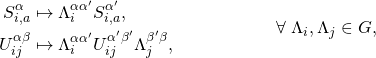
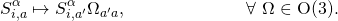
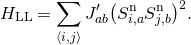

Lattice Gauge Model Client Code
===============================

Generalized nematics with polyhedral mesogens can serve as a testbed for the
detection and realization of multipolar orders. To this end, a lattice gauge
model is employed, first introduced in [Phys. Rev. X **6**, 041025 (2016)][1].
On each site of a cubic lattice, a triad of three orthogonal “spins”,
_{**S**<sup>l</sup>, **S**<sup>m</sup>, **S**<sup>n</sup>}_ with
_**S**<sup>α</sup> × **S**<sup>β</sup> = ±ε<sub>αβγ</sub> **S**<sup>γ</sup>_,
fully determines the orientation (and chirality) of a mesogen. _α, β, γ = l, m,
n_ are referred to as “color indices”. The classical Hamiltonian is then given
by


where the interaction between mesogens on nearest-neighboring sites is mediated
through additional fields _U<sub>ij</sub> ∈ G ⊂ O(3)_ which live on the bonds.
_G_ is the intended point group of the mesogens. These fields are in fact gauge
fields, as the Hamiltonian possesses a local point-group symmetry (Einstein
summation implied),



in addition to a global _O(3)_ symmetry,



Since it is impossible to spontaneously break a gauge symmetry, the model
eventually orders into a state which breaks _O(3)_ down to _G_, possibly through
one or more intermediate phases with symmetry _G<sub>0</sub>_ such that _G ⊂
G<sub>0</sub> ⊂ O(3)_ [see [Phys. Rev. E **95**, 022704 (2017)][2]]. The
ground-state manifold is hence given by _O(3)/G_. The phase transitions between
these phases have been found to be generically of first order, except in special
cases where fine-tuning of the interaction coupling can give second order
transitions.

For example, when _G = O(2)_, the gauge theory recovers the Heisenberg model
with general exchange interaction while for _G = D<sub>∞h</sub>_ it reduces to
the Lebwohl-Lasher model [[Phys. Rev. A **6**, 426–429 (1972)][3]],



A mathematical derivation of these limits is provided in [Phys. Rev. E **94**,
022701 (2016)][4].

For the purpose of machine-learning these order parameters, raw configurations
are sampled from the Monte Carlo simulation of the gauge model and fed to
TK-SVM. The three “spins” defining the local triad are thus treated as separate
spins in a spin cluster. Their Greek color index takes the place of the
sublattice index.

The results of applying TK-SVM to the various orders realized in the gauge
model, and analyses thereof, are published in:
* Jonas Greitemann, Ke Liu, and Lode Pollet: _Probing hidden spin order with
  interpretable machine learning_, [**Phys. Rev. B 99, 060404(R) (2019)**][5],
  open access via [arXiv:1804.08557][6];
* Ke Liu, Jonas Greitemann, and Lode Pollet: _Learning multiple order parameters
  with interpretable machines_, [**Phys. Rev. B 99, 104410 (2019)**][7], open
  access via [arXiv:1810.05538][8].

Building and Installation
-------------------------

CMake is used to build this code:
```bash
$ cd svm-order-params/gauge
$ mkdir build && cd build
$ cmake ..
$ make -jN
```

Finally, using `make install` the compiled executables can be copied to the
`bin` directory at the location configured in `CMAKE_INSTALL_PREFIX`. This step
is optional.

Refer to the [top-level README](../README.md) for information on dependencies
and cloning of submodules.

Examples & Usage
----------------

For the [→ Basic Usage](../README.md#basic-usage) of the TK-SVM framework, refer
to the top-level README.

An assortment of example parameter files are provided in the [`params`](params)
directory. Each comes with an explanatory comment and detailed instruction on
how to invoke the executables.

Runtime parameters
------------------

This sections lists the runtime parameters which are defined by — and exclusive
to — this client code. These parameters supplement those lists in the section
[→ Runtime parameters](../README.md#runtime-parameters) of the top-level README.

### Simulation runtime

After an initial thermalization phase of `thermalization_sweeps` MC _sweeps_,
`total_sweeps` _sweeps_ are carried out and observables are measured after each.
Each sweep consists of `sweep_unit` _unit steps_. Each unit step in turn picks a
number of random sites corresponding to the number of lattice sites. On each
site, `hits_R` Metropolis attempts are made at updating the local spins and
`hits_U` Metropolis attempts are made at updating the local gauge fields.

Additionally, once per MC sweep, with probability `global_gauge_prob`, all spins
are rotated by a random _O(3)_ transformation. Such a microcanonical update does
not reduce autocorrelations on physical observables which are themselves _O(3)_
invariant but can help when "learning" such observables using a machine that
does not impose that symmetry explicitly. See [J. Greitemann's PhD thesis][9],
Sec. 3.3.1, for further details and motivation in the context of TK-SVM.

| Parameter name          | Default | Description                                        |
|:------------------------|:-------:|:---------------------------------------------------|
| `total_sweeps`          | `0`     | Number of MC steps per phase diagram point sampled |
| `thermalization_sweeps` | `10000` | Thermalization steps after each phase point change |
| `sweep_unit`            | `10`    | Number of unit steps per Monte Carlo sweep         |
| `hits_R`                | `1`     | Number of updates to local spins per MC unit step  |
| `hits_U`                | `1`     | Number of updates to gauge fields per MC unit step |
| `global_gauge_prob`     | `0.05`  | Probability to perform global gauge transformation |

### Model parameters

| Parameter name            | Default          | Description                                                                                |
|:--------------------------|:----------------:|:-------------------------------------------------------------------------------------------|
| `length`                  | _required_       | Linear system size                                                                         |
| `gauge_group`             | _required_       | One of: `Cinfv`, `Dinfh`, `D2h`, `D2d`, `D3`, `D3h`, `T`, `Td`, `Th`, `O`, `Oh`, `I`, `Ih` |
| `group_size`              | _required_       | Number of elements in the gauge group (_has to be chosen accordingly_)                     |
| `O3`                      | `0`              | Whether the group is a subgroup of SO(3) (`0`) or just O(3) (`1`) (_choose accordingly_)   |
| `temperature`             | `1`              | Temperature (_rescales J<sub>1</sub>, J<sub>3</sub> couplings, keep at 1_)                 |
| `<phase-diag-point-spec>` | _optional_       | Initial phase diagram point (_not relevant for TKSVM use case_)                            |

The parameters `gauge_group`, `group_size`, and `O3` have to be selected
according to the desired gauge symmetry group, as listed in the table below:

| Group symbol     | `gauge_group` | `group_size` | `O3` |
|:-----------------|:--------------|:------------:|:----:|
| _C<sub>∞v</sub>_ | `Cinfv`       |      `1`     | `1`  |
| _D<sub>∞h</sub>_ | `Dinfh`       |      `2`     | `1`  |
| _D<sub>2h</sub>_ | `D2h`         |      `8`     | `1`  |
| _D<sub>2d</sub>_ | `D2d`         |      `8`     | `1`  |
| _D<sub>3</sub>_  | `D3`          |      `6`     | `0`  |
| _D<sub>3h</sub>_ | `D3h`         |     `12`     | `1`  |
| _T_              | `T`           |     `12`     | `0`  |
| _T<sub>d</sub>_  | `Td`          |     `24`     | `1`  |
| _T<sub>h</sub>_  | `Th`          |     `24`     | `1`  |
| _O_              | `O`           |     `24`     | `0`  |
| _O<sub>h</sub>_  | `Oh`          |     `48`     | `1`  |
| _I_              | `I`           |     `60`     | `0`  |
| _I<sub>h</sub>_  | `Ih`          |    `120`     | `1`  |

### Tensorial kernel

| Parameter name | Default    | Description                                                                                      |
|:---------------|:----------:|:-------------------------------------------------------------------------------------------------|
| `rank`         | _required_ | Rank of the monomial mapping                                                                     |
| `symmetrized`  | `1`        | Eliminate redundant (symmetric) monomials (`1`) or not (`0`)                                     |
| `color`        | `triad`    | Consider single spin per site (`mono`) or all three (`triad`)                                    |
| `cluster`      | `single`   | Use `single` spin cluster, `bipartite` lattice (two-spin cluster), or `full` spin configurations |

### Phase diagram point specification

The parameter space of the gauge model is spanned by the temperature as well as
the two couplings _J<sub>1</sub> = J<sub>2</sub>_ and _J<sub>3</sub>_ which
parametrize the diagonal coupling matrix, 

The (inverse) temperature may be absorbed into the couplings, resulting in a
two-dimensional parameter space. Points in the phase diagram are described by
the type [`J1J3`](include/tksvm/gauge/phase_space/point/J1J3.hpp). The following
parameters thus replace mentions of `<phase-diag-point-spec>` in the
specification of the other parameters:

| `J1J3` phase diagram point                      | Default          | Description                                            |
|:------------------------------------------------|:----------------:|:-------------------------------------------------------|
| `J1`                                            | `0`              | _β J<sub>1</sub>_ coupling                             |
| `J3`                                            | `0`              | _β J<sub>3</sub>_ coupling                             |


[1]: https://doi.org/10.1103/PhysRevX.6.041025
[2]: https://doi.org/10.1103/PhysRevE.95.022704
[3]: https://doi.org/10.1103/PhysRevA.6.426
[4]: https://doi.org/10.1103/PhysRevE.94.022701
[5]: https://doi.org/10.1103/PhysRevB.99.060404
[6]: https://arxiv.org/abs/1804.08557
[7]: https://doi.org/10.1103/PhysRevB.99.104410
[8]: https://arxiv.org/abs/1810.05538
[9]: https://nbn-resolving.org/urn:nbn:de:bvb:19-250579
